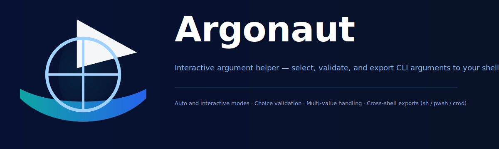

# Argonaut

Commandline helper — select, validate, and export CLI arguments to your shell.

Note: the originally planned interactive UI is not implemented yet. Current functionality is non-interactive: Argonaut helps you define and validate command-line argument rules and then emits shell-specific statements that set environment variables (either for the current session or persistently). The goal is to let you focus on your script logic while Argonaut handles argument parsing, validation and cross-shell export semantics.

Motivation
----------
Writing robust shell or script argument handling is time consuming and platform-specific. Argonaut centralizes argument rules and validation so your scripts can receive validated inputs as environment variables across sh-like shells, PowerShell and cmd.

Installation
------------
install using go cmdline tool:

```bash
go install github.com/vipcxj/argonaut@latest
```

Usage overview
--------------
Argonaut is a CLI program. The main subcommand used to produce shell exports is `bind`. The `bind` command accepts flag specifications (defaults, choices, multi-value, export flags, etc.) and current argument values, then prints shell statements appropriate for the current target shell.

The tool prints shell commands (for sh-compatible shells), PowerShell statements, or Windows cmd statements depending on the configured target. You should evaluate or source the printed output in your shell so the environment variables take effect in the current session.

Examples
--------

1) PowerShell — set a variable in the current session

Generate PowerShell commands and immediately execute them in the current PowerShell session:

```powershell
# Generate a PowerShell assignment for NAME and execute it immediately
argonaut.exe bind \
  --flag=name \
  --flag-name-default=happy \
  --flag-name-choices="happy,people" \
  --flag-name-multi \
  -- a --name=people | Invoke-Expression
if ($Env:IS_HELP -eq 'true') {
  # User requested help; exit successfully
  exit 0
}
# Verify:
$Env:NAME
```

Notes:
- If Argonaut emits `setx` (persistent on Windows), `setx` updates the registry and affects future sessions — it does not change the current PowerShell session. To update the current session, Argonaut will emit `$Env:VAR = 'value'` which must be executed in the session (via Invoke-Expression or similar).

2) POSIX shell (bash / sh / zsh) — evaluate into current session

Use `eval` or `source`/process substitution to apply exports produced by Argonaut:

```bash
# Example: produce exports and evaluate them in the current shell script
# Note quote around $@, it is necessary, don't wrap the whole argonaut command with the quote
EVAL_CONTENT=$(argonaut bind \
  --flag=flag1 \
  --flag-flag1-default=happy \
  --flag-flag1-choices=happy,people \
  --flag-flag1-multi \
  -- a "$0" "$@")
# The quote around $EVAL_CONTENT is necessary as well.
eval "$EVAL_CONTENT"
if [ "$IS_HELP" = "true" ]; then
  # It means the user request the help, so exit with 0
  exit 0
fi

# Here should be your really logic, you can use the env which hold the flag value now.

# Such as just echo:
echo "$FLAG1"
```

3) Windows cmd (cmd.exe) — persistent vs session

Argonaut may print either `set "VAR=value"` for the current cmd session, or `setx VAR "value"` for persistent user-level environment variables. To apply a session assignment, pipe the output to `cmd /V:ON /C` or copy-paste the single-line output into cmd.

Design examples demonstrating features
------------------------------------
Below are representative invocations that exercise features Argonaut supports. Replace `./argonaut` with `argonaut.exe` on Windows.

- Default and choices:

```bash
./argonaut bind \
  --flag=username \
  --flag-username-default=guest \
  --flag-username-choices="guest,admin,user" \
  -- a --username=admin
```

- Multi-value flag:

```bash
# Example where flag allows multiple values (stored and emitted as a single representation)
./argonaut bind \
  --flag=tags \
  --flag-tags-multi \
  --flag-tags-multi-format=csv \
  -- a --tags=one --tags=two --tags=three
```

- Export (persist vs session):

```powershell
# Emit session-only PowerShell assignment
Invoke-Expression -Command (.\argonaut.exe bind --flag=foo --flag-foo-export=false -- a --foo=bar)

# Emit persistent Windows user env var (setx) — affects future sessions only
.\argonaut.exe bind --flag=foo --flag-foo-export=true -- a --foo=bar
```

Validation and ranges
---------------------
Argonaut includes value validation primitives (e.g. integer range parsing and checks). When a flag has validation rules (ranges, choices), Argonaut validates the provided values and will report errors instead of emitting export statements. Use the `bind` command to define rules and pass current args; Argonaut performs validation and produces shell-safe assignments only when inputs pass validation.

Scripting integration recommendations
-----------------------------------
- For POSIX shells prefer `eval "$(./argonaut bind ... )"` or `source <(./argonaut bind ...)` to apply variables into the current shell.
- For PowerShell prefer `Invoke-Expression -Command (.\argonaut.exe bind ...)` or pipe the output through `Out-String | Invoke-Expression`.
- For cmd, copy/paste or execute the printed `set` line to affect the current session; `setx` is used for persistence and does not change the current session.

Contributing
------------
Contributions welcome — feel free to open PRs. The project is in active development; interactive mode and other features are planned but not yet implemented.

License
-------
This project is licensed under the Apache-2.0 License. See `LICENSE` for details.